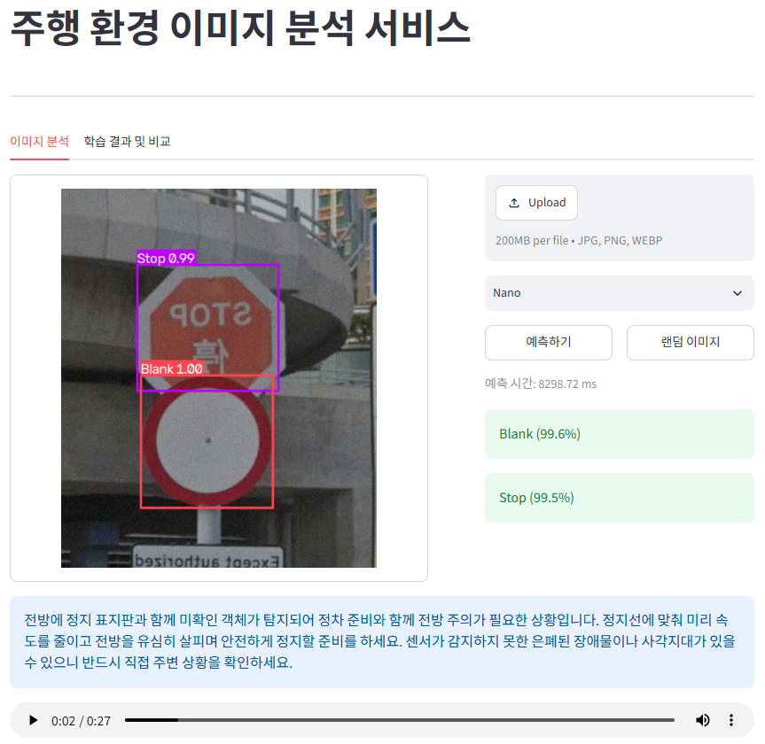
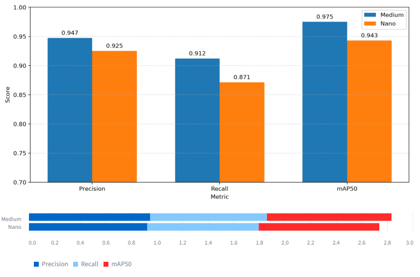
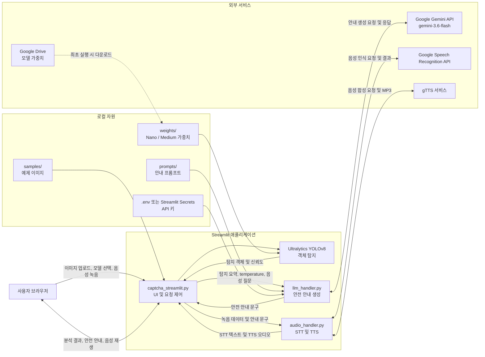
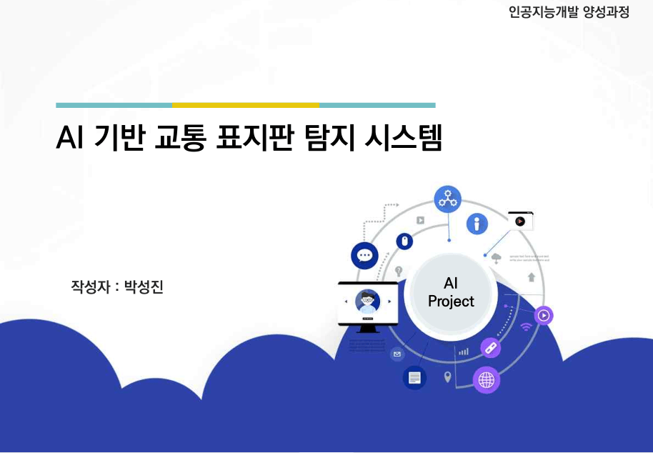
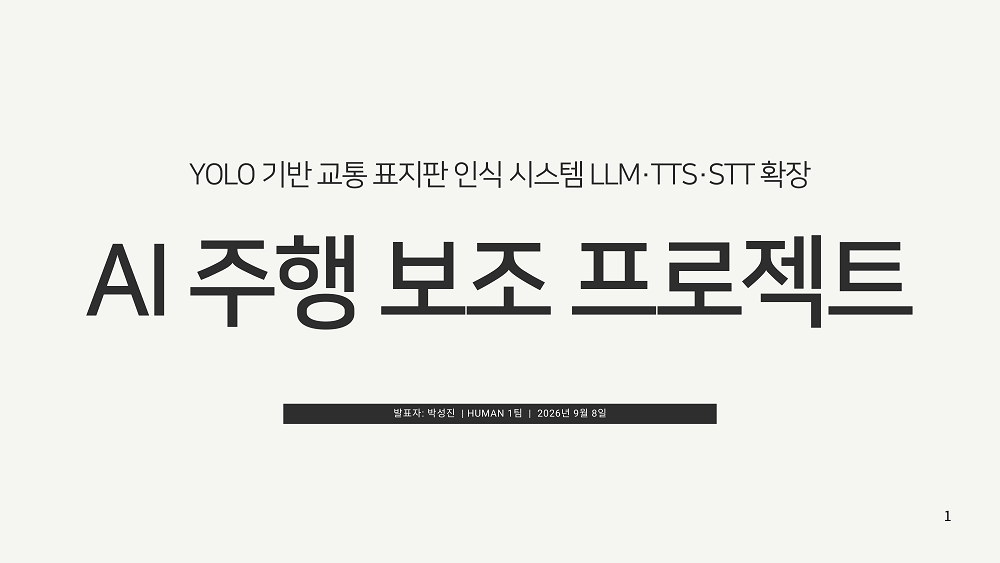

# Driving Environment Image Analysis


## 프로젝트 소개 및 접속 링크

YOLOv8 기반 객체 탐지와 Gemini LLM 기반 안전 안내를 결합한 Streamlit 웹 애플리케이션입니다. 주행 환경 이미지를 분석해 교통 표지판을 탐지하고, 탐지 결과와 운전자의 음성 질문을 바탕으로 상황별 안내 문구를 제공합니다.

[서비스 접속 링크](https://sign-captcha.streamlit.app/)

Streamlit 배포 정책상 12시간 동안 트래픽이 발생하지 않으면 서버가 휴면 상태에 들어갈 수 있습니다. 접속 시 기동 안내가 표시되면 **AWAKE 버튼**을 클릭해 서비스를 깨운 뒤 이용해 주세요.

## 기획 배경 및 문제 정의

주행 중 운전자는 도로 표지판과 주변 환경을 빠르게 인식하고, 그 의미를 안전한 행동으로 연결해야 합니다. 하지만 표지판이 작거나 복잡한 도로 환경에서는 시각 정보만으로 상황을 즉시 판단하기 어렵고, 운전 중 긴 설명을 확인하는 것도 부담이 될 수 있습니다.

이 프로젝트는 다음 문제를 해결하는 것을 목표로 합니다.

- 주행 환경 이미지에서 표지판 객체를 자동으로 탐지
- 탐지된 객체를 바탕으로 운전자에게 필요한 안전 안내 제공
- 음성 질문을 통해 운전자가 화면을 직접 조작하지 않고 추가 안내 요청
- 안내 문구를 음성으로 재생하여 주행 상황에서 정보 접근성 향상

## 시연 영상 및 서비스 화면

### 시연 영상

<!-- YouTube 링크 또는 영상 썸네일을 준비한 뒤 아래 주석을 해제하세요. -->

<!--
[](https://www.youtube.com/watch?v=VIDEO_ID)
-->

시연 영상 링크: `[추가 필요]`

### 서비스 화면

| 표지판 객체 탐지 | 학습 결과 성능 비교 |
| --- | --- |
|  |  |

## 주요 기능

### 1. 탐지 대상 이미지 업로드
- JPG, JPEG, PNG, WEBP 형식의 주행 환경 이미지 업로드
- `samples/` 폴더의 예제 이미지 무작위 선택
### 2. 모델 예측
- YOLOv8 Nano / Medium 모델 선택 및 표지판 객체 탐지
- 탐지 이미지, 객체명, 신뢰도, 추론 시간 표시
### 3. 예측 결과 LLM 연동
- 탐지된 객체 종류와 개수를 Gemini에 전달하여 안전 안내 생성
- 사이드바에서 LLM temperature와 안내 프롬프트 버전 조정
### 4. VUI 연동
- 브라우저 마이크 녹음 및 Google Speech Recognition 기반 한국어 STT
- 탐지 결과와 인식된 음성 질문을 함께 전달하는 추가 질의
- 생성된 안내 문구의 gTTS 기반 한국어 TTS 자동 재생
### 0. 모델 관리
- Precision, Recall, mAP50 기반 모델 성능 비교
- 모델 가중치가 없을 때 Google Drive에서 자동 다운로드

## 기술 스택

| 구분 | 기술 |
| --- | --- |
| 언어 | Python 3.10+ |
| 객체 탐지 | Ultralytics YOLOv8 |
| 웹 대시보드 | Streamlit |
| 데이터 처리 | pandas, numpy |
| 시각화 | matplotlib |
| 이미지 처리 | Pillow, OpenCV |
| 생성형 AI | Google Gemini API (`gemini-3.6-flash`) |
| 음성 입력 | streamlit-mic-recorder, Google Speech Recognition (한국어 STT) |
| 음성 출력 | gTTS (한국어 TTS) |
| 모델 파일 관리 | gdown, Google Drive |
| 실험/학습 환경 | Jupyter Notebook |

## 모델 성능 비교 및 평가

| 모델 | Precision | Recall | mAP50 | 모델 파일 크기 | 학습 시간 | 예측 시간 |
| --- | ---: | ---: | ---: | ---: | ---: | ---: |
| Nano | 0.9252 | 0.8714 | 0.9430 | 6,088 KB | 약 5~6분 | 약 30ms |
| Medium | 0.9474 | 0.9122 | 0.9750 | 50,840 KB | 약 10~12분 | 약 70ms |

Medium 모델은 Precision, Recall, mAP50이 더 높아 탐지 성능에 유리합니다. Nano 모델은 파일 크기와 예측 시간이 더 작아 빠른 응답과 경량 실행 환경에 적합합니다.

위 수치는 프로젝트가 개발된 로컬 환경에서 측정된 수치입니다.

### 로컬 하드웨어
| CPU | RAM | VGA |
| --- | --- | --- |
| i7-14700 | 64GB | RTX 4070 ti super(16GB)|

## 시스템 파이프라인 및 상호작용 흐름

### 시스템 아키텍처 다이어그램



### LLM 프롬프팅 및 음성(STT/TTS) 연동 프로세스

1. 사용자가 이미지를 업로드하거나 `samples/`의 예제 이미지를 선택합니다.
2. 선택한 YOLOv8 모델이 이미지에서 객체를 탐지하고, 애플리케이션이 객체 종류와 개수를 집계합니다.
3. `llm_handler.py`가 탐지 요약, 선택한 프롬프트, temperature를 결합해 Gemini API에 전달합니다.
4. Gemini가 생성한 안전 안내 문구를 화면에 표시하고, `audio_handler.py`가 gTTS로 한국어 음성을 생성합니다.
5. 사용자가 마이크로 질문하면 `streamlit-mic-recorder`가 오디오를 전달하고 Google Speech Recognition이 한국어 텍스트로 변환합니다.
6. 이미지 분석이 완료된 경우 탐지 정보와 STT 결과를 함께 Gemini에 전달해 추가 안내를 생성합니다.
7. 분석 전에 음성 질문을 보내면 먼저 이미지 분석이 필요하다는 안내를 표시합니다.

프롬프트 파일은 다음과 같이 관리합니다.

- 기본 안전 가이드: `prompts/safety_guide_prompt.md`
- 간결 모드: `prompts/short_prompt.md`

## 연구 보고서 및 실험 문서

| 모델 학습과 성능 개선 | VUI 연결과 프롬프트 엔지니어링 |
| --- | --- |
|  |  |
| [모델 학습 보고서](https://drive.google.com/file/d/1MSKBBslu3yHva1ifJ_1mnqzxKrfizkxc/view?usp=sharing) | [VUI 및 프롬프팅 보고서](https://drive.google.com/file/d/1TiLdma-SNRPBGLOobVZK2Bydbn_kfdQ_/view?usp=sharing) |

### 모델 학습 파라미터
```python
epochs=60,
imgsz=320,
batch=64,
workers=8,
device=device,
amp=True,
```

## 프로젝트 디렉토리 구조

```text
.
├── captcha_streamlit.py            # Streamlit 웹 애플리케이션
├── llm_handler.py                  # Gemini API 호출 및 프롬프트 처리
├── audio_handler.py                # 한국어 STT 및 TTS 처리
├── 박성진_딥러닝프로젝트.ipynb       # 데이터 분석 및 YOLO 모델 학습 노트북
├── .env.example                    # Roboflow 및 Gemini 환경 변수 예시
├── requirements.txt                # 애플리케이션 실행 의존성
├── requirements(local).txt         # 로컬 학습/분석 환경 의존성
├── dataset/                        # 데이터셋 폴더
├── docs/
│   ├── images/                     # README 화면 및 보고서 이미지
│   └── videos/                     # 시연 영상 파일
├── prompts/                        # Gemini 안내 프롬프트
│   ├── safety_guide_prompt.md
│   └── short_prompt.md
├── samples/                        # 서비스에서 사용하는 예제 이미지
└── weights/                        # 첫 실행 시 자동 다운로드되는 가중치
    ├── v8n_best.pt
    └── v8m_best.pt
```

## 실행 방법

### 1. 사전 요구사항 및 의존성 설치

- Python 3.10 이상
- pip
- Gemini, Google Speech Recognition, gTTS 사용을 위한 인터넷 연결
- 음성 입력 사용 시 마이크와 브라우저 권한

```powershell
git clone <repository-url>
cd DLPRJ
python -m venv .venv
.\.venv\Scripts\Activate.ps1
pip install -r requirements.txt
```

노트북에서 데이터 분석 또는 모델 재학습까지 진행하는 경우:

```powershell
pip install -r "requirements(local).txt"
```

PowerShell 실행 정책 오류가 발생하면 다음 명령을 실행한 뒤 가상환경을 다시 활성화합니다.

```powershell
Set-ExecutionPolicy -Scope CurrentUser -ExecutionPolicy RemoteSigned
```

macOS / Linux에서는 다음 명령을 사용합니다.

```bash
python3 -m venv .venv
source .venv/bin/activate
pip install -r requirements.txt
```

### 2. 모델 가중치 및 외부 API 키 설정 (`.env`)

프로젝트 루트의 `.env.example`을 복사해 `.env`를 만들고 값을 입력합니다.

```powershell
Copy-Item .env.example .env
```

```dotenv
ROBOFLOW_API_KEY=your_roboflow_api_key
ROBOFLOW_WORKSPACE=your_workspace_name
ROBOFLOW_PROJECT=your_project_name
GEMINI_API_KEY=your_gemini_api_key
```

- `ROBOFLOW_*`: 노트북에서 Roboflow 데이터셋을 내려받을 때 사용합니다.
- `GEMINI_API_KEY`: 탐지 결과 기반 안전 안내를 생성할 때 사용합니다.
- `.env`는 `.gitignore`에 포함되어 있으므로 실제 API 키를 커밋하지 마세요.
- Streamlit Cloud 배포 시에는 `.env` 대신 Streamlit Secrets에 `GEMINI_API_KEY`를 등록할 수 있습니다.
- `weights/`에 모델 파일이 없으면 애플리케이션 첫 실행 시 Google Drive에서 자동으로 다운로드합니다.

### 3. 로컬 실행 명령어

```powershell
streamlit run captcha_streamlit.py
```

실행 후 브라우저에서 `http://localhost:8501`에 접속합니다. Gemini API 키가 없어도 YOLO 객체 탐지와 모델 성능 비교는 사용할 수 있지만, AI 안전 안내는 제한됩니다.

## 핵심 트러블슈팅 및 배운 점

### 트러블슈팅

| 증상 | 해결 방안 |
| --- | --- |
| Groq API 호출 오류 | Groq 서비스 장애, Gemini API로 교체해서 해결 |
| 구형 Gemini 모델 지원 종료 | 1.5 flash, 2.5 flash 호출 시 에러 및 호출 불가능, 3.6 flash 호출로 해결 |
| Gemini API 트래픽 과다 | 503 UNAVAILABLE 에러 발생, 무료 플랜 트래픽 한도 이슈로 대기 후 재호출 |
| 오디오 포맷 불일치 | STT 처리 중 포맷 오류, SpeechRecognition이 요구하는 WAV 형식으로 변환해서 해결 |
| Streamlit 배포 오류 | 패키지 및 라이브러리 인스톨 실패, 리눅스 환경에 맞는 라이브러리 및 패키지 명세 분리로 해결 |

### 배운 점

- 기술 구현에서 시스템 구성으로 시야 확장
    - 이전 프로젝트가 원천기술을 직접 구현하고 성능을 검증하는 과정이었다면, 이번 프로젝트에서는 도메인에 적합한 인터페이스와 사용 흐름을 구성하는 경험을 할 수 있었다.
- 시스템 호환성 검증 및 트러블슈팅
    - 여러 라이브러리와 외부 API를 연동하며 기술 간 호환성과 전체 시스템을 고려하는 시야를 넓힐 수 있었으며, 프롬프트 엔지니어링을 통해 논리적이고 구조적으로 의도를 전달하는 것의 중요성도 체감할 수 있었다.
- 다른 운영체제 호환성 검증 및 대응
    - 특히 Windows 환경에서의 개발에 익숙한 상태에서 클라우드 배포 과정에서 Linux 기반 환경의 라이브러리 및 시스템 의존성 차이를 직접 경험하며, 개발 환경에 따른 동작 방식까지 고려할 필요성을 배울 수 있었다.


### 프로젝트의 한계

- 외부 AI 서비스 활용에 따른 성능 및 환경 제약
    - 무료 API 기준 응답 속도와 트래픽 측면에서 한계가 명확함
    - 추후 충분한 자원이 확보된다면 성능 개선을 목표로 개발 예정

### 향후 발전 계획

- 인식 대상 및 기능 확장
    - 표지판 외에 차량, 신호, 사람 등 다양한 객체 인식
- 시스템 성능 개선
    - 처리 과정의 응답 속도 증대
- 주행 보조 시스템 적용
    - 영상 등 멀티모달 처리 목표

## 데이터셋 출처 및 참고 사항

- 데이터셋 제공 플랫폼: [Roboflow](https://roboflow.com/)
- 원본 데이터셋 링크: [Sign Computer Vision Dataset](https://universe.roboflow.com/polyu-7fox0/sign-dwnah)
- 데이터셋 작성자: polyu
- 데이터셋 라이선스 및 저작권 조건: [CC BY 4.0](https://creativecommons.org/licenses/by/4.0/legalcode.ko)

본 프로젝트는 딥러닝 학습 및 포트폴리오 목적으로 작성되었습니다. 
