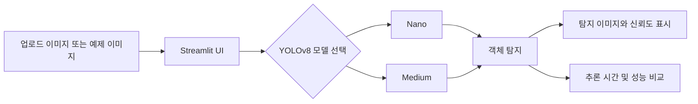

# Driving Environment Image Analysis

YOLOv8 기반 객체 탐지 모델을 사용해 주행 환경 이미지에서 교통 표지판 객체를 탐지하는 Streamlit 웹 애플리케이션입니다. 이미지 업로드 또는 제공된 예제 이미지를 선택해 Nano와 Medium 모델의 추론 결과를 확인하고, 모델별 평가 지표와 실행 특성을 비교할 수 있습니다.

## 주요 기능

- JPG, JPEG, PNG, WEBP 형식의 주행 환경 이미지 업로드
- `samples/` 폴더의 예제 이미지를 무작위로 선택하여 빠르게 테스트
- YOLOv8 Nano / Medium 모델 선택 및 객체 탐지 결과 표시
- 탐지된 객체명, 신뢰도, 추론 시간 제공
- Precision, Recall, mAP50 기반 모델 성능 비교 시각화
- 모델 파일이 없을 때 Google Drive에서 자동 다운로드

## 서비스 화면

애플리케이션은 다음 두 탭으로 구성됩니다.

| 이미지 분석 | 학습 결과 및 비교 |
| --- | --- |
| 이미지를 업로드하거나 랜덤 예제 이미지를 선택한 뒤 모델을 골라 객체 탐지를 실행합니다. | Nano와 Medium 모델의 Precision, Recall, mAP50 및 파일 크기, 학습/추론 시간을 비교합니다. |

<!-- 아래 이미지 파일을 docs/images/에 추가한 후 주석을 해제하세요. -->

<!--
| 이미지 분석 화면 | 학습 결과 및 비교 화면 |
| --- | --- |
|  |  |
-->

## 시연 영상

서비스 실행부터 이미지 업로드, 모델 선택, 객체 탐지 결과 확인까지의 흐름을 담은 시연 영상을 추가할 자리입니다.

<!-- 동영상 파일을 docs/videos/에 추가하거나 YouTube 링크로 교체한 후 주석을 해제하세요. -->

<!--
[](https://www.youtube.com/watch?v=VIDEO_ID)
-->

## 기술 스택


| 구분 | 기술 |
| --- | --- |
| 언어 | Python 3.10+ |
| 객체 탐지 | Ultralytics YOLOv8 |
| 웹 대시보드 | Streamlit |
| 데이터 처리 | pandas, numpy |
| 시각화 | matplotlib |
| 이미지 처리 | Pillow, OpenCV |
| 모델 파일 관리 | gdown, Google Drive |
| 실험/학습 환경 | Jupyter Notebook |

## 아키텍처



- 학습 및 분석: `박성진_딥러닝프로젝트.ipynb`에서 데이터 탐색과 모델 학습을 수행합니다.
- 서빙: `captcha_streamlit.py`가 학습된 YOLO 가중치를 로드하여 이미지 추론과 평가 지표 시각화를 제공합니다.
- 모델 관리: 첫 실행 시 `weights/` 폴더에 없는 가중치를 Google Drive에서 다운로드합니다.

## 프로젝트 구성

```text
.
├── captcha_streamlit.py            # Streamlit 웹 애플리케이션
├── 박성진_딥러닝프로젝트.ipynb       # 데이터 분석 및 YOLO 모델 학습 노트북
├── .env.example                    # Roboflow 데이터셋 접근 환경 변수 예시
├── requirements.txt                # 애플리케이션 실행 의존성
├── requirements(local).txt         # 로컬 학습/분석 환경 의존성
├── dataset/                        # 데이터셋 보관 폴더
├── samples/                        # 서비스에서 사용하는 예제 이미지
├── docs/
│   ├── images/                     # README 서비스 화면 및 영상 썸네일
│   └── videos/                     # README 시연 영상 파일
└── weights/                        # 첫 실행 시 자동 다운로드되는 모델 가중치
    ├── v8n_best.pt
    └── v8m_best.pt
```

## 실행 방법

### 1. 사전 요구사항

- Python 3.10 이상
- pip

### 2. 저장소 클론

```powershell
git clone <repository-url>
cd DLPRJ
```

### 3. 가상환경 생성 및 활성화

Windows PowerShell:

```powershell
python -m venv .venv
.\.venv\Scripts\Activate.ps1
```

PowerShell에서 실행 정책 오류가 발생하면 다음 명령을 실행한 뒤 다시 활성화합니다.

```powershell
Set-ExecutionPolicy -Scope CurrentUser -ExecutionPolicy RemoteSigned
```

macOS / Linux:

```bash
python3 -m venv .venv
source .venv/bin/activate
```

### 4. 패키지 설치

```powershell
pip install -r requirements.txt
```

노트북에서 데이터 분석 또는 재학습까지 진행하려면 로컬 분석 환경 의존성을 설치합니다.

```powershell
pip install -r "requirements(local).txt"
```

### 5. Roboflow 환경 변수 설정 (모델 학습 시)

데이터셋을 Roboflow에서 내려받아 노트북으로 학습하려면 프로젝트 루트에 `.env` 파일을 만들고, `.env.example`의 값을 본인 Roboflow 프로젝트 정보로 변경합니다.

```powershell
Copy-Item .env.example .env
```

`.env` 파일:

```dotenv
ROBOFLOW_API_KEY=your_roboflow_api_key
ROBOFLOW_WORKSPACE=your_workspace_name
ROBOFLOW_PROJECT=your_project_name
```

`ROBOFLOW_WORKSPACE`와 `ROBOFLOW_PROJECT`에는 Roboflow URL에 표시되는 워크스페이스 및 프로젝트 슬러그를 입력합니다. `.env`는 `.gitignore`에 포함되어 있어 API 키가 Git에 커밋되지 않습니다.

### 6. 애플리케이션 실행

```powershell
streamlit run captcha_streamlit.py
```

실행 후 브라우저에서 `http://localhost:8501`로 접속합니다. 최초 실행에서는 두 YOLO 모델 가중치가 `weights/` 폴더로 자동 다운로드되므로 인터넷 연결이 필요합니다.

## 모델 비교

| 모델 | Precision | Recall | mAP50 | 모델 파일 크기 | 학습 시간 | 예측 시간 |
| --- | ---: | ---: | ---: | ---: | ---: | ---: |
| Nano | 0.9252 | 0.8714 | 0.9430 | 6,088 KB | 약 5~6분 | 약 30ms |
| Medium | 0.9474 | 0.9122 | 0.9750 | 50,840 KB | 약 10~12분 | 약 70ms |

Medium 모델은 정확도 지표가 더 높고, Nano 모델은 파일 크기와 추론 시간이 더 작아 경량 환경에 적합합니다.

## 참고

- 본 프로젝트는 딥러닝 학습 및 포트폴리오 목적으로 작성되었습니다.
- `weights/`의 모델 가중치는 애플리케이션 실행 시 자동으로 내려받습니다.
- 데이터셋 출처와 사용 조건은 학습 노트북 및 데이터셋 원본의 라이선스를 확인해 주세요.